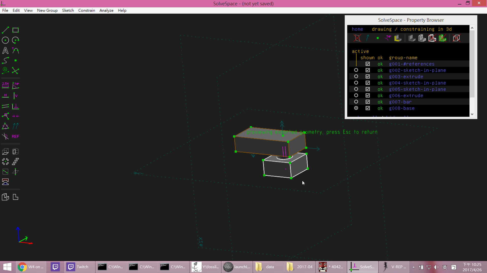

Title: Week 4
Date: 2017-03-15 22:00
Category: Course
Tags: 建立協同主機和單桿機構組件
Slug: Week 4
Author: 40423242

建立協同主機和單桿機構組件

 <h3>建立協同主機 2017springcd_bg8</h3>
 

2017springcd_bg8: <a href="https://mde2a2.kmol.info/cdbg8">https://mde2a2.kmol.info/cdbg8</a>

 <h3>單桿機構</h3>

<iframe src="../data/W4.html" width="800" height="480"></iframe>

<h3>問題</h3>

這次GitHub又發生跟上次一樣推送出現問題，要刪除 plugin 下的 liquid_tags 目錄。

<h3>影片</h3>

<iframe src="https://player.vimeo.com/video/214851007" width="640" height="480" frameborder="0" webkitallowfullscreen mozallowfullscreen allowfullscreen></iframe>

<h3><a href="https://vimeo.com/user60353473">個人影片區</a></h3>

<h3>心得</h3>

這禮拜繪製簡單的單桿機構，在推送時又發生問題了。
